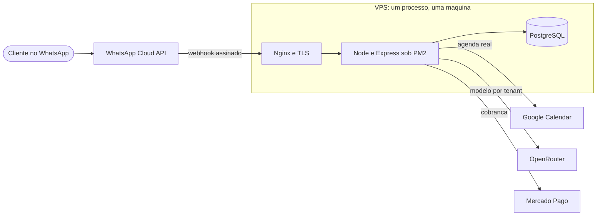
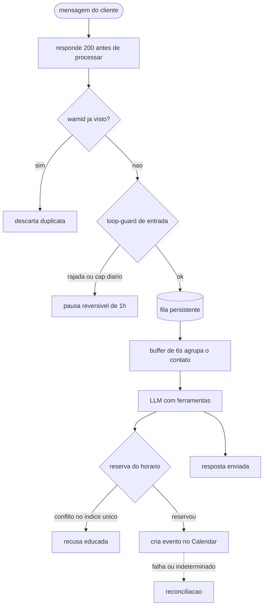
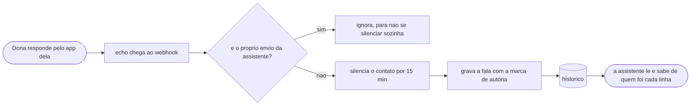
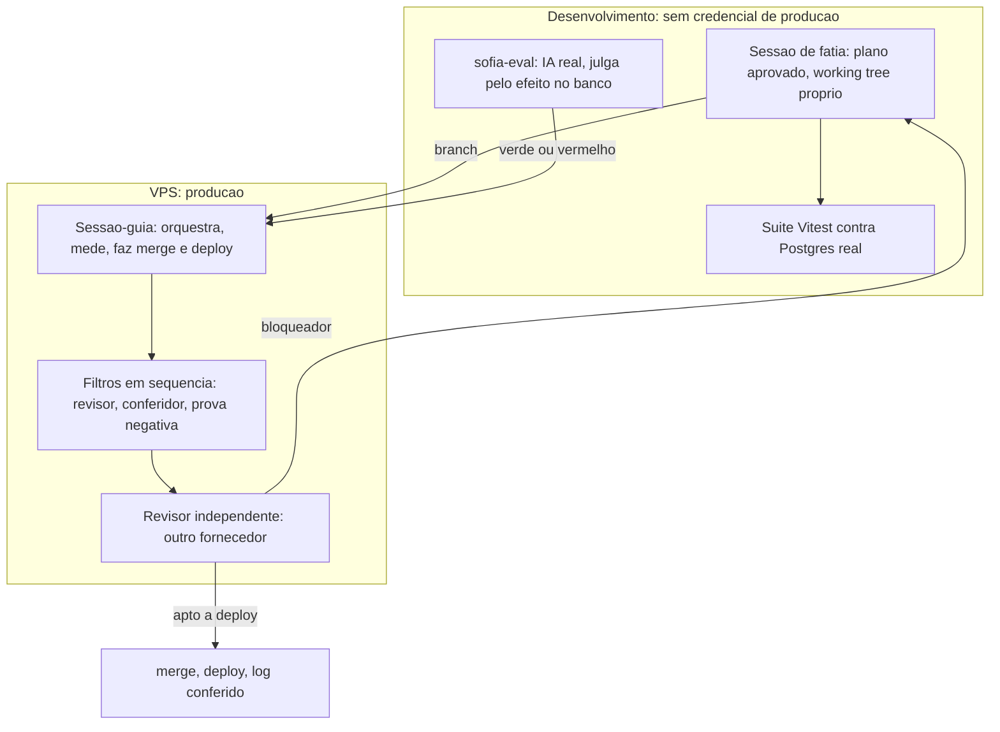

# Sofia — assistente de agendamento por WhatsApp

Assistente de IA que atende clientes de pequenos negócios pelo WhatsApp:
conversa, consulta a agenda real (Google Calendar), marca e cancela horários e
cobra via Pix. Multi-tenant — cada cliente é um tenant com número, prompt,
catálogo, profissionais e agenda próprios.

O código de produção é privado. Este repositório mostra a arquitetura e os
trechos que valem leitura — escolhidos por mostrarem decisão, não por serem os
maiores.

**No ar:** [riachotech.com.br](https://riachotech.com.br) ·
[@riacho_tech](https://www.instagram.com/riacho_tech/) 

---

## 1. O que é, e a prova de que está no ar

Em produção desde **08/08/2026**, numa VPS própria, recebendo e respondendo
tráfego real pela **API oficial** (WhatsApp Business Platform) — nunca
automação de WhatsApp Web.

Stack deliberadamente pequena: **Node.js + Express, PostgreSQL, PM2, Nginx**.
Sem framework de bot, sem fila externa, sem contêineres. O que essa escolha
exige em troca — concorrência e falha resolvidas com o banco e com o desenho —
é o assunto do resto deste README.


## 2. Arquitetura

### A infraestrutura, inteira

Uma máquina, um processo, três serviços externos. Sem fila externa, sem
contêiner, sem framework de bot.



### O caminho de uma mensagem

Cada ramo de falha aparece onde é tratado — é o que a stack pequena exige em
troca.



Cinco decisões definem o sistema — cada uma com o porquê e o custo aceito:

1. **O webhook responde 200 antes de processar.** Sem resposta rápida a Meta
   reentrega, e reentrega alimenta loop e duplicata. Custo: tudo vira
   assíncrono, e é preciso fila persistente e dedup em duas camadas (memória
   + `UNIQUE` no banco, que sobrevive a restart).
2. **A trava de agendamento é um índice único parcial no Postgres** — não
   lock distribuído. A chave é o horário em si, e o `INSERT ... ON CONFLICT
   DO NOTHING` é a reserva atômica. A primeira versão incluía o telefone na
   chave, e dois clientes conseguiam cada um reservar "o seu" mesmo horário —
   achado de revisão externa. Custo: reserva local e evento no Google são
   dois passos, o que exige a reconciliação da seção 4.
3. **O loop-guard é camada própria, antes do buffer.** Conta qualquer mensagem
   que possa gerar resposta (loop bot-a-bot também acontece por sticker) e
   roda depois do dedup, senão reentrega inflaria o contador.
4. **A fila não deleta — troca status** (`pendente → processando → concluida |
   erro`). Linha com erro continua elegível para reprocesso no próximo boot:
   mensagem de cliente não se perde por causa de um deploy. Custo: restart
   reprocessa o que ficou no meio — isso já reacendeu um loop pausado, e
   virou regra de operação escrita.
5. **Um processo, uma máquina.** Para dezenas de tenants de agendamento o
   gargalo não é CPU — é acerto de concorrência. Custo declarado:
   indisponibilidade breve no restart, mitigada pela fila.

## 3. Como sei que funciona

**A suíte prova o encanamento.** 47 arquivos / 694 testes (Vitest) contra
**Postgres real** — só a IA e a API da Meta são simuladas. (O número se rederiva
com `npm test`; ele muda a cada fatia, e por isso não vive em comentário de
código neste projeto.) Arquivos em série
(`fileParallelism: false`): os testes provam concorrência de verdade, então
não podem competir entre si por engano.

**Espera por sinal, não por tempo.** Como o webhook responde antes de
processar, o teste espera condições observáveis (a linha existir, o status
virar terminal). A única espera por tempo é a de asserção negativa ("nada foi
enviado"), que não tem sinal por definição — e a janela dela foi medida, não
chutada: 72 amostras, máximo 173 ms, folga = 2× o máximo ≈ 350 ms.

**O que a suíte NÃO prova é o comportamento do modelo.** Esse é o papel do
[`sofia-eval`](https://github.com/andrenv14/sofia-eval), repositório irmão,
público: monta payloads reais de webhook, assina como a Meta assinaria, ataca
por HTTP com IA real e **julga pelo efeito no banco** — agendamento criado?
duração certa? nada inventado? — não pelo texto da resposta. São 16 cenários, e
**cada um tem teto de chamadas e de tokens calibrado por medição** — 3 passadas,
teto igual a 2× o máximo observado, todos contra o mesmo modelo e o mesmo commit.
O teto não é conforto: é o que faz uma regressão de custo aparecer como falha em
vez de virar conta no fim do mês. Um cenário do eval achou um bug real que a
suíte não tinha como ver.


**O prompt de produção tem snapshot byte a byte** — comparado com `toBe`
contra um arquivo de referência, não com `toMatchSnapshot`: não pode ser
regenerado em silêncio por um `vitest -u`.

**Correção de bug exige prova negativa.** Os testes novos rodam contra o
código antigo e têm que FALHAR, pelo motivo esperado. Já derrubou parecer de
revisão: uma busca por nome errava em dois sentidos, e o segundo só apareceu
na prova negativa.

## 4. Mecanismos que valem leitura

### O webhook só aceita o que a Meta assinou

```js
function assinaturaValida(req) {
  const assinatura = req.get('x-hub-signature-256');
  if (!assinatura || !req.rawBody) return false;

  const esperado =
    'sha256=' + crypto.createHmac('sha256', config.meta.appSecret).update(req.rawBody).digest('hex');

  try {
    return crypto.timingSafeEqual(Buffer.from(assinatura), Buffer.from(esperado));
  } catch {
    return false;
  }
}
```

Dois detalhes fáceis de errar: o HMAC é sobre os **bytes crus** (capturados no
`verify` do `express.json` — assinar o objeto re-serializado não bate), e o
`timingSafeEqual` fica dentro de `try`, porque buffers de tamanhos diferentes
lançam — e isso não pode virar 500.

### Loop-guard: janela deslizante com pausa reversível

Existe porque aconteceu: dois bots conversando entre si, milhares de mensagens
até alguém notar. Em produção desde 23/08/2026 — e no mesmo dia cortou um
reacendimento real em 22 minutos: 61 chamadas de LLM, 534.728 tokens. (Medido
depois: 58,7% do gasto daquele dia, e o dia inteiro foi 1,65% do gasto do mês —
o número assusta menos do que parece, e é publicado assim mesmo.)

```js
const LOOP_MAX_MSGS = 35;        // rajada: 35 msgs em 120s
const LOOP_MAX_MSGS_HORA = 60;   // cadência: 60 msgs em 1h
const LOOP_MAX_MSGS_DIA = 150;   // cap diário, virado no fuso do tenant
const LOOP_PAUSA_MS = 3600000;   // pausa de 1h, reversível sozinha

export function registrarEntrada(chave, { timezone, agora = Date.now() } = {}) {
  const e = estadoDe(chave);

  if (e.pausadoAte && agora < e.pausadoAte) {
    return { permitido: false, motivo: e.motivo, pausadoAte: e.pausadoAte };
  }
  if (e.pausadoAte && agora >= e.pausadoAte) {
    e.pausadoAte = null;   // pausa venceu — volta a atender normalmente
    e.motivo = null;
  }

  e.eventos.push(agora);
  e.eventos = e.eventos.filter((t) => agora - t < RETENCAO_EVENTOS_MS);

  if (contadorDiario(e, timezone, agora) > LOOP_MAX_MSGS_DIA) {
    return pausar(e, 'cap_diario', agora, viradaDoDia(timezone, agora));
  }
  if (e.eventos.filter((t) => agora - t < LOOP_JANELA_MS).length > LOOP_MAX_MSGS) {
    return pausar(e, 'rajada', agora, agora + LOOP_PAUSA_MS);
  }
  if (e.eventos.length > LOOP_MAX_MSGS_HORA) {
    return pausar(e, 'cadencia', agora, agora + LOOP_PAUSA_MS);
  }
  return { permitido: true };
}
```

O corte real, como saiu no log (o telefone nasce mascarado pelo código de log):

```
[loop-guard] contato ****7703 PAUSADO — motivo: cadencia
(61 msgs em 1h (teto 60)) — pausado por ~60min
```

### Runner de migrations: perguntar ao banco, não interpretar SQL

Migration aplicada à mão em duas máquinas causou dois erros de "o arquivo
viajou no pull, o efeito não". O runner aplica o que falta, uma transação por
arquivo — e como alguns arquivos têm `BEGIN;`/`COMMIT;` próprios, ele **não
interpreta o SQL** para descobrir o que aconteceu: pergunta ao Postgres, com
`txid_status`, o veredito da transação que abriu.

```js
await client.query('BEGIN');
const t0 = await txidAtual(client);            // SELECT txid_current()
try {
  await client.query(sql);                     // texto original, sem transformação
} catch (err) {
  await client.query('ROLLBACK').catch(() => {});
  const status = await statusTxid(client, t0); // SELECT txid_status($1)
  throw new ErroMigration(nome, err, status === 'committed');
}
const status = await statusTxid(client, t0);
if (status !== 'in progress' && status !== 'committed') {
  // 'aborted': o PRÓPRIO arquivo deu ROLLBACK sem lançar erro.
  // A direção segura é recusar, não assumir sucesso.
  throw new ErroMigration(nome, new Error(`terminou em "${status}"`));
}
```

Na adoção contra a base real: 24 migrations reconhecidas, 0 aplicadas por
engano, 0 falhas. O limite é declarado no próprio runner: SQL executado depois
do fim de `t0` é indeterminado — nesse caso ele para e pede inspeção humana.

### Reconciliação: um sinal, três estados

Reserva local e evento no Google são dois passos. Entre eles, um único sinal —
linha ativa sem `google_event_id` — cobre três estados que pedem reações
diferentes:

| Estado | O banco diz | O Google tem | Dura |
|---|---|---|---|
| em voo | reserva | nada ainda | ~1,2 s (mediana medida) |
| órfã | reserva | nada, nunca | para sempre |
| vínculo perdido | reserva | o evento existe | para sempre |

Os números vêm de medição em produção — mediana 1.174 ms, p95 1.270 ms, máximo
1.378 ms — e deles derivam as constantes: espera limitada de 1.500 ms (acima
do p95) relendo o banco a cada 250 ms **antes** de consultar o Google (o
inverso pagaria ~1,2 s em toda corrida que a releitura resolve de graça), e
varredura por cron com limiar de 15 min (~650× o máximo observado — margem,
não limite). Quando nada disso resolve, o sistema não afirma o que não sabe:

```js
return {
  sucesso: false,
  erro: 'Ainda não consegui confirmar esse horário, tenta de novo em instantes.',
  precisa_verificar_novamente: true,
};
```

A invariante: **criar agendamento nunca devolve sucesso sem o vínculo do
evento**. E a varredura roda por cron, não por `setInterval` — `setInterval`
morre com o processo, e morte de processo é justamente o que gera órfã.

### Coexistence: duas vozes no mesmo número, e como o sistema sabe de quem é cada linha

O cliente não troca de número nem para de usar o WhatsApp no celular: a dona da
clínica responde pelo aplicativo dela e a assistente responde no mesmo número —
o modo **Coexistence** da plataforma oficial. Isso cria um problema que um bot
comum não tem: **duas pessoas escrevem do mesmo lado da conversa.**



A plataforma entrega a fala da dona num campo diferente do da mensagem do
cliente (`smb_message_echoes` em vez de `messages`). Três coisas acontecem
quando ela chega:

1. **O sistema reconhece o próprio eco.** Toda mensagem que a assistente envia
   volta como echo. Sem essa checagem ela se silenciaria sozinha a cada resposta.
2. **A assistente se cala por 15 minutos naquele contato.** Quem assumiu a
   conversa é uma pessoa; falar por cima é pior que ficar quieto.
3. **A fala da dona entra no histórico com uma marca de autoria.**

A marca é o que faz o resto funcionar. Gravar a fala da dona como se fosse do
cliente ensinaria a assistente que o cliente disse o que a dona disse; mantê-la
do lado da assistente, sem marca, faz a assistente confundir promessa da dona
com promessa própria.

```js
export const MARCA_ATENDIMENTO = '[mensagem enviada pelo atendimento]';

export function comMarcaDeAtendimento(texto) {
  return `${MARCA_ATENDIMENTO} ${texto}`;
}
```

Duas linhas, e a disciplina está no que elas **não** afirmam: a marca diz quem
escreveu aquela linha e nada mais — não afirma que o horário citado existe, nem
que não existe. O módulo é folha porque quem monta o prompt de sistema o
consome, e a instrução **interpola** a constante em vez de repetir o texto:
marca e instrução não têm como divergir.

A instrução existe só para tenant em Coexistence e fecha o caso que motivou
tudo: se numa linha marcada a pessoa ofereceu um horário e o cliente aceita
("pode ser", "confirmado então"), a assistente **não confirma** — chama a
ferramenta de atendente humano e avisa que a equipe assume. Ela não agenda o que
não foi ela quem ofereceu e verificou.

**Como sei que funciona.** O cenário `17-marca-de-autoria-do-dono` do
`sofia-eval` foi escrito para nascer VERMELHO, e nasceu: em três passadas a
assistente confirmou um horário que nunca ofereceu nem verificou. Depois da
marca, verde em três passadas, com a pendência de atendimento humano gravada no
banco — e o mesmo cenário contra o código anterior continua vermelho, que é o
controle separando "a correção funcionou" de "o modelo teve um dia bom".

## 5. Dados e operação como propriedades

- **Retenção é por tenant e o banco a executa.** `retention_days` (padrão 90)
  é coluna editável no painel; um job diário apaga conversas mais velhas que o
  prazo — inclusive de tenants inativos. O limite é documentado com a mesma
  franqueza: a retenção cobre as mensagens, não (ainda) as tabelas
  operacionais — escrito onde quem promete prazo a cliente lê antes de
  prometer.
- **Log nunca carrega conteúdo nem telefone.** Toda linha que toca um contato
  passa por máscara (4 últimos dígitos); o texto da mensagem não vai para log
  em hipótese nenhuma. O módulo do loop-guard nem recebe telefone em claro.
- **Dado pessoal fora do fluxo nasce com data de morte.** Quando um módulo foi
  removido do produto, o dump de segurança das tabelas dele já nasceu com a
  data de expurgo registrada por escrito, nas duas máquinas que o guardavam.
- **Operação com carimbo:** logs de cron com timestamp ISO por linha, rotação
  de logs do processo, e a varredura de órfãs loga tenant, horário e veredito
  de cada linha em que agiu — nunca o telefone.

## 6. Como o projeto é construído: uma pessoa e agentes com papéis fixos

O sistema é escrito por uma pessoa dirigindo agentes de IA, e a parte que vale
ler não é "usei IA para programar" — é o **arranjo que torna o resultado
verificável**.

**Duas máquinas, e a separação é de segurança.** A VPS é produção: atende
cliente pagante, e por isso não roda a suíte em horário de movimento. O ambiente
de desenvolvimento roda a suíte e o avaliador de comportamento, e **não tem
nenhuma credencial de produção** — token da plataforma falso, banco de teste,
chave de LLM com teto próprio. Nada que vaze de um lado alcança o outro.



**Papéis fixos, e nenhum acumula dois.**

| Papel | O que faz | O que nunca faz |
|---|---|---|
| Sessão-guia | orquestra, mede, dispara os filtros, faz merge e deploy | implementar fatia |
| Sessão de fatia | uma por vez, working tree próprio, plano aprovado antes da primeira linha | revisar o próprio diff |
| Sessão do avaliador | roda o `sofia-eval` com IA real | tocar o código de produção |
| Subagentes | revisor de diff, conferidor de citações, prova negativa, auditores de infra e de documentação | decidir merge |
| Revisor independente | **outro modelo, de outro fornecedor**: lê a branch inteira e declara "apto a deploy" ou devolve o bloqueador | implementar qualquer coisa |

**As regras que fazem o arranjo valer alguma coisa.** Nenhuma é preferência:
cada uma existe porque a ausência dela deixou passar algo.

- **Concordar não é corroborar.** Dois agentes que leram o mesmo código com o
  mesmo ponto cego são uma fonte contada duas vezes. Duas fontes só contam
  quando podiam discordar.
- **Medição que sustenta um merge carrega o commit e o estado da árvore no
  cabeçalho** — sem isso o número não se liga ao código que vai ao ar. Para
  reaproveitar uma medição entre dois commits, o que autoriza é o hash da
  árvore de `src/`, não a mensagem do commit.
- **Texto durável cita arquivo e nome de função, nunca número de linha.** Nome
  sobrevive a deslocamento; linha envelhece em silêncio. Contagem só entra com
  o comando que a rederiva.
- **Verificação que passa observando nada precisa primeiro ser vista falhar.**
  "Nenhum agendamento criado" é satisfeito pelo acerto e também pelo sistema não
  ter rodado: quebra-se o código de propósito para ver a asserção ficar vermelha.
- **A terceira correção seguida na mesma classe vira redesenho, não quarta
  correção.**
- **Os filtros rodam em sequência** — disputam working tree, banco de teste e
  porta.

**O deploy segue roteiro escrito**: suíte verde antes, commit antes da migration,
reinício depois, e então o log do processo no ar — não a suíte de novo, que
testaria o mesmo código em vez do processo que está atendendo.

## 7. O que ficou de fora, e por quê

Cortar escopo é decisão de projeto, não falta dele.

**Base de documentos com busca semântica (RAG).** A infraestrutura estava
disponível, e a demanda real não estava: nenhum cliente pediu, e o mesmo
resultado era obtido configurando o comportamento por tenant. Feature sem
comprador não entra na fila.

**Disparo em massa.** O sistema envia lembrete de utilidade — mensagem sobre
um agendamento que a pessoa marcou. Campanha para lista é outro produto, com
outro regime de consentimento e outra relação com a plataforma. Recusar isso é
posicionamento, e a assistente comercial é instruída a recusar quando pedem.

**Aplicativo móvel próprio.** O cliente já tem o WhatsApp instalado. Um app a
mais é fricção a mais para resolver um problema que não existe.

---

## Sobre este repositório

Repositório de leitura, não de execução. Os trechos foram escolhidos por
mostrarem decisão, estão levemente condensados (helpers triviais omitidos) e
não carregam dado de cliente. O repositório irmão
[`sofia-eval`](https://github.com/andrenv14/sofia-eval) — a parte pública
executável — mostra como o comportamento do modelo é avaliado de fora, pelo
efeito no banco.
