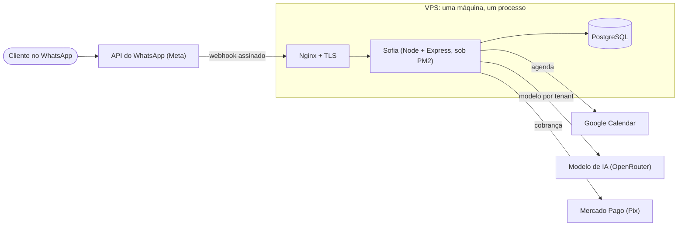
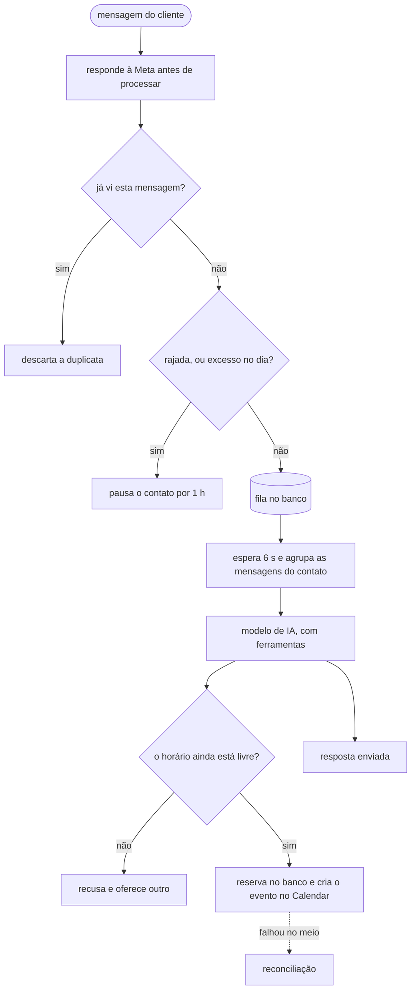
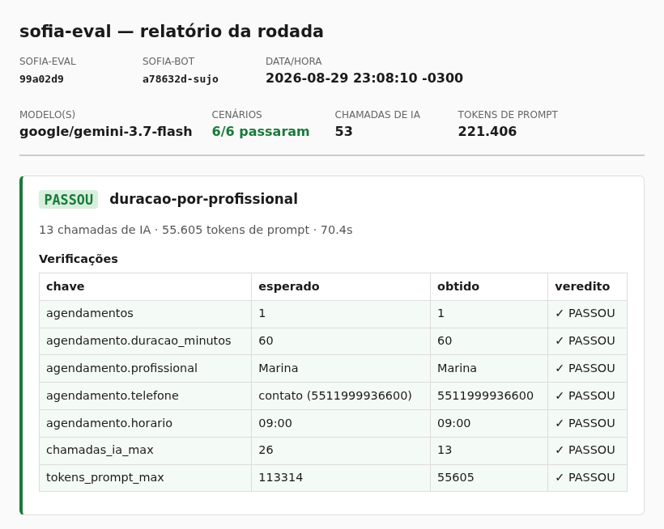
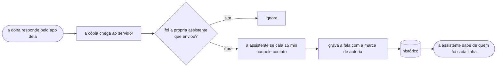
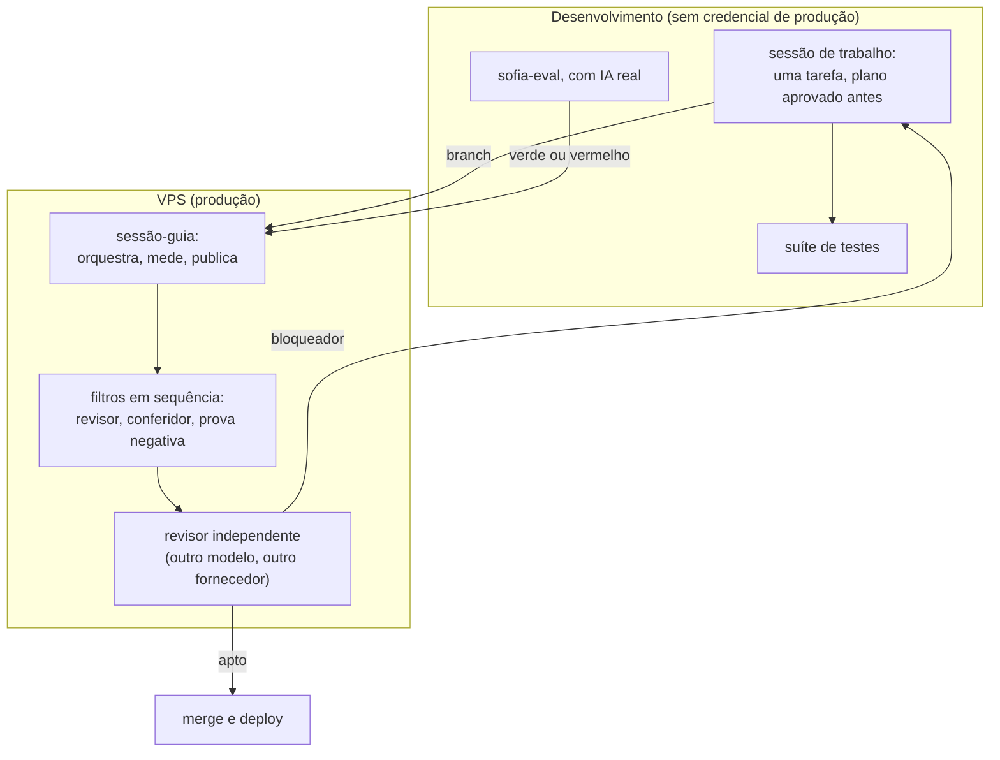

# Sofia — assistente de agendamento por WhatsApp

Assistente de IA que atende clientes de pequenos negócios pelo WhatsApp:
conversa, consulta a agenda de verdade (Google Calendar), marca e cancela
horários e cobra por Pix. Cada negócio que usa a Sofia é um *tenant*: tem
número, instruções, catálogo, profissionais e agenda próprios, dentro do mesmo
sistema.

O código de produção é privado. Este repositório mostra a arquitetura e os
trechos que valem leitura. Escolhi os que mostram uma decisão, não os maiores.

**No ar:** [riachotech.com.br](https://riachotech.com.br) ([o código do site](https://github.com/andrenv14/riachotech-site)) ·
[@riacho_tech](https://www.instagram.com/riacho_tech/) ·
[`sofia-eval`](https://github.com/andrenv14/sofia-eval), o avaliador de
comportamento, é público e roda.

---

## 1. O que é, e a prova de que está no ar

Em produção desde **08/08/2026**, numa VPS própria (um servidor virtual
alugado), recebendo e respondendo tráfego real pela **API oficial** do WhatsApp
(WhatsApp Business Platform). Nunca por automação do WhatsApp Web.

A stack é pequena de propósito: **Node.js + Express, PostgreSQL, PM2, Nginx**.
Sem framework de bot, sem fila externa, sem contêiner. O preço dessa escolha é
resolver concorrência e falha com o banco e com o desenho, e é disso que o resto
deste README trata.


## 2. Arquitetura

### A infraestrutura inteira

Uma máquina, um processo, três serviços externos.



*Webhook* é a chamada HTTP que a Meta faz ao meu servidor a cada mensagem nova.
"Assinado" quer dizer que ela chega com uma assinatura criptográfica, e o
servidor confere antes de ler (seção 4).

### O caminho de uma mensagem



Cinco decisões definem o sistema. Cada uma tem um porquê e um custo aceito.

1. **O servidor responde à Meta antes de processar.** Se a resposta demora, a
   Meta reenvia a mensagem, e reenvio alimenta duplicata e laço. Custo: tudo
   vira assíncrono, e é preciso uma fila que sobreviva a reinício e uma
   checagem de duplicata em duas camadas (memória e uma restrição `UNIQUE` no
   banco, pelo identificador que a Meta dá a cada mensagem).
2. **A trava de agendamento é um índice único no Postgres**, não um lock
   distribuído. A chave é o horário em si, e o `INSERT ... ON CONFLICT DO
   NOTHING` é a reserva: ou entra, ou não entra. A primeira versão incluía o
   telefone na chave, e dois clientes conseguiam cada um reservar "o seu"
   mesmo horário. Foi um achado de revisão externa. Custo: reservar no banco e
   criar o evento no Google são dois passos, e é por isso que existe a
   reconciliação da seção 4.
3. **A guarda contra laço é uma camada própria, antes do agrupamento.** Ela
   conta qualquer mensagem que possa gerar resposta (dois bots já entraram em
   laço por causa de um sticker) e roda depois da checagem de duplicata,
   senão o reenvio inflaria o contador.
4. **A fila não apaga, troca status** (`pendente → processando → concluida |
   erro`). Linha com erro continua elegível para reprocesso no próximo boot:
   mensagem de cliente não se perde por causa de um deploy. Custo: reiniciar
   reprocessa o que ficou no meio, o que já reacendeu um laço pausado. Virou
   regra de operação escrita.
5. **Um processo, uma máquina.** Para dezenas de negócios de agendamento o
   gargalo não é CPU, é acertar a concorrência. Custo declarado: uns segundos
   fora do ar no reinício, amenizados pela fila.

## 3. Como sei que funciona

**A suíte prova o encanamento.** São 47 arquivos e 694 testes (Vitest) contra
um **Postgres real**. Só a IA e a API da Meta são simuladas. O número se
rederiva com `npm test`; ele muda a cada fatia de trabalho, e por isso não vive
em comentário de código. Os arquivos rodam um de cada vez
(`fileParallelism: false`): os testes provam concorrência de verdade, então não
podem competir entre si por engano.

**Espera por sinal, não por tempo.** Como o servidor responde antes de
processar, o teste espera algo observável (a linha existir, o status ficar
final). A única espera por tempo é a de "nada foi enviado", que não tem sinal
por definição, e a janela dela foi medida: 72 amostras, máximo de 173 ms, folga
de 2× o máximo, ≈ 350 ms.

**O que a suíte não prova é o comportamento do modelo.** Esse é o papel do
[`sofia-eval`](https://github.com/andrenv14/sofia-eval), repositório irmão e
público. Ele monta a mensagem que a Meta enviaria, assina como ela assinaria,
bate no servidor com IA real e **julga pelo efeito no banco**: o agendamento
foi criado? com a duração certa? nada inventado? Não pelo texto da resposta.
São 16 cenários, e **cada um tem um teto de chamadas e de tokens medido**: 3
passadas, teto igual a 2× o máximo observado, contra o mesmo modelo e o mesmo
commit. O teto existe para uma regressão de custo aparecer como falha em vez de
virar conta no fim do mês. Um cenário do eval achou um bug real que a suíte não
tinha como ver.



**O prompt de produção tem cópia de referência, comparada byte a byte** com
`toBe`, não com `toMatchSnapshot`. Assim ele não pode ser regenerado em
silêncio por um `vitest -u`.

**Correção de bug exige prova negativa.** Os testes novos rodam contra o código
antigo e têm de FALHAR, pelo motivo esperado. Isso já derrubou um parecer de
revisão: uma busca por nome errava em dois sentidos, e o segundo só apareceu na
prova negativa.

## 4. Mecanismos que valem leitura

### O servidor só aceita o que a Meta assinou

A Meta assina cada chamada com HMAC: um resumo criptográfico do corpo da
requisição, feito com um segredo que só ela e o servidor conhecem. Se a
assinatura não bate, a mensagem é descartada.

```js
function assinaturaValida(req) {
  const assinatura = req.get('x-hub-signature-256');
  if (!assinatura || !req.rawBody) return false;

  const esperado =
    'sha256=' + crypto.createHmac('sha256', config.meta.appSecret).update(req.rawBody).digest('hex');

  try {
    return crypto.timingSafeEqual(Buffer.from(assinatura), Buffer.from(esperado));
  } catch {
    return false;
  }
}
```

Dois detalhes fáceis de errar. O HMAC é calculado sobre os **bytes crus** da
requisição (capturados no `verify` do `express.json`); assinar o objeto
reserializado não bate. E o `timingSafeEqual` fica dentro de `try`, porque
buffers de tamanhos diferentes lançam erro, e isso não pode virar um 500.

### Guarda contra laço: janela deslizante com pausa que se desfaz sozinha

Existe porque aconteceu: dois bots conversando entre si, milhares de mensagens
até alguém notar. Está em produção desde 23/08/2026, e no mesmo dia cortou um
laço real em 22 minutos: 61 chamadas ao modelo, 534.728 tokens. Medido depois:
58,7% do gasto daquele dia, e o dia inteiro foi 1,65% do gasto do mês. O número
assusta menos do que parece, e publico assim mesmo.

```js
const LOOP_MAX_MSGS = 35;        // rajada: 35 msgs em 120s
const LOOP_MAX_MSGS_HORA = 60;   // cadência: 60 msgs em 1h
const LOOP_MAX_MSGS_DIA = 150;   // cap diário, virado no fuso do tenant
const LOOP_PAUSA_MS = 3600000;   // pausa de 1h, reversível sozinha

export function registrarEntrada(chave, { timezone, agora = Date.now() } = {}) {
  const e = estadoDe(chave);

  if (e.pausadoAte && agora < e.pausadoAte) {
    return { permitido: false, motivo: e.motivo, pausadoAte: e.pausadoAte };
  }
  if (e.pausadoAte && agora >= e.pausadoAte) {
    e.pausadoAte = null;   // pausa venceu — volta a atender normalmente
    e.motivo = null;
  }

  e.eventos.push(agora);
  e.eventos = e.eventos.filter((t) => agora - t < RETENCAO_EVENTOS_MS);

  if (contadorDiario(e, timezone, agora) > LOOP_MAX_MSGS_DIA) {
    return pausar(e, 'cap_diario', agora, viradaDoDia(timezone, agora));
  }
  if (e.eventos.filter((t) => agora - t < LOOP_JANELA_MS).length > LOOP_MAX_MSGS) {
    return pausar(e, 'rajada', agora, agora + LOOP_PAUSA_MS);
  }
  if (e.eventos.length > LOOP_MAX_MSGS_HORA) {
    return pausar(e, 'cadencia', agora, agora + LOOP_PAUSA_MS);
  }
  return { permitido: true };
}
```

O corte real, como saiu no log (o telefone já nasce mascarado pelo código de
log):

```
[loop-guard] contato ****7703 PAUSADO — motivo: cadencia
(61 msgs em 1h (teto 60)) — pausado por ~60min
```

### Migrations: perguntar ao banco em vez de interpretar SQL

*Migration* é um arquivo SQL que muda a estrutura do banco. Aplicá-lo à mão em
duas máquinas causou dois erros do tipo "o arquivo viajou no `git pull`, o
efeito não". O runner aplica o que falta, uma transação por arquivo. Como
alguns arquivos têm `BEGIN;`/`COMMIT;` próprios, ele **não interpreta o SQL**
para descobrir o que aconteceu: pergunta ao Postgres, com `txid_status`, qual
foi o veredito da transação que abriu.

```js
await client.query('BEGIN');
const t0 = await txidAtual(client);            // SELECT txid_current()
try {
  await client.query(sql);                     // texto original, sem transformação
} catch (err) {
  await client.query('ROLLBACK').catch(() => {});
  const status = await statusTxid(client, t0); // SELECT txid_status($1)
  throw new ErroMigration(nome, err, status === 'committed');
}
const status = await statusTxid(client, t0);
if (status !== 'in progress' && status !== 'committed') {
  // 'aborted': o PRÓPRIO arquivo deu ROLLBACK sem lançar erro.
  // A direção segura é recusar, não assumir sucesso.
  throw new ErroMigration(nome, new Error(`terminou em "${status}"`));
}
```

Na adoção contra a base real: 24 migrations reconhecidas, 0 aplicadas por
engano, 0 falhas. O limite está declarado no próprio runner: SQL executado
depois do fim de `t0` é indeterminado, e nesse caso ele para e pede inspeção
humana.

### Reconciliação: um sinal, três situações

Reservar no banco e criar o evento no Google são dois passos. Entre eles, um
único sinal (linha ativa sem `google_event_id`) cobre três situações que pedem
reações diferentes:

| Situação | O banco diz | O Google tem | Dura |
|---|---|---|---|
| em voo | reserva | nada ainda | ~1,2 s (mediana medida) |
| órfã | reserva | nada, nunca | para sempre |
| vínculo perdido | reserva | o evento existe | para sempre |

Os números vêm de medição em produção: mediana de 1.174 ms, p95 (o valor que
95% das vezes não é ultrapassado) de 1.270 ms, máximo de 1.378 ms. Deles saem
as constantes. O sistema espera até 1.500 ms (acima do p95) relendo o banco a
cada 250 ms **antes** de consultar o Google, porque o inverso pagaria ~1,2 s em
toda corrida que a releitura resolve de graça. Uma varredura agendada (cron)
pega o que sobrou, com limiar de 15 min, ~650× o máximo observado: margem, não
limite. Quando nada disso resolve, o sistema não afirma o que não sabe:

```js
return {
  sucesso: false,
  erro: 'Ainda não consegui confirmar esse horário, tenta de novo em instantes.',
  precisa_verificar_novamente: true,
};
```

A regra que nunca quebra: **criar agendamento não devolve sucesso sem o vínculo
do evento**. E a varredura roda por cron, não por `setInterval`, porque
`setInterval` morre com o processo, e morte de processo é justamente o que gera
órfã.

### Coexistence: duas vozes no mesmo número

O cliente não troca de número nem para de usar o WhatsApp no celular. A dona da
clínica responde pelo aplicativo dela e a assistente responde no mesmo número.
É o modo **Coexistence** da plataforma oficial, e ele cria um problema que um
bot comum não tem: **duas pessoas escrevem do mesmo lado da conversa.**



A plataforma entrega a fala da dona num campo diferente do da mensagem do
cliente (`smb_message_echoes` em vez de `messages`). Três coisas acontecem
quando ela chega:

1. **O sistema reconhece a própria mensagem.** Toda mensagem que a assistente
   envia volta como cópia. Sem essa checagem, ela se silenciaria sozinha a cada
   resposta.
2. **A assistente se cala por 15 minutos naquele contato.** Quem assumiu a
   conversa é uma pessoa; falar por cima é pior que ficar quieto.
3. **A fala da dona entra no histórico com uma marca de autoria.**

A marca é o que faz o resto funcionar. Gravar a fala da dona como se fosse do
cliente ensinaria a assistente que o cliente disse o que a dona disse. Mantê-la
do lado da assistente, sem marca, faz a assistente confundir promessa da dona
com promessa própria.

```js
export const MARCA_ATENDIMENTO = '[mensagem enviada pelo atendimento]';

export function comMarcaDeAtendimento(texto) {
  return `${MARCA_ATENDIMENTO} ${texto}`;
}
```

Duas linhas, e a disciplina está no que elas **não** afirmam: a marca diz quem
escreveu aquela linha e nada mais. Não diz que o horário citado existe, nem
que não existe. Quem monta o prompt de sistema **interpola** a constante em vez
de repetir o texto, então marca e instrução não têm como divergir.

A instrução existe só para tenant em Coexistence e fecha o caso que motivou
tudo: se numa linha marcada a pessoa ofereceu um horário e o cliente aceita
("pode ser", "confirmado então"), a assistente **não confirma**. Ela chama a
ferramenta de atendente humano e avisa que a equipe assume. Ela não agenda o
que não foi ela quem ofereceu e verificou.

**Como sei que funciona.** O cenário `17-marca-de-autoria-do-dono` do
`sofia-eval` foi escrito para nascer VERMELHO, e nasceu: em três passadas a
assistente confirmou um horário que nunca ofereceu nem verificou. Depois da
marca, verde em três passadas, com a pendência de atendimento humano gravada
no banco. E o mesmo cenário contra o código anterior continua vermelho, que é
o controle que separa "a correção funcionou" de "o modelo teve um dia bom".

## 5. Dados e operação

- **Retenção é por tenant, e o banco a executa.** `retention_days` (padrão 90)
  é uma coluna editável no painel; um job diário apaga conversas mais velhas
  que o prazo, inclusive de tenants inativos. O limite está escrito com a
  mesma franqueza: a retenção cobre as mensagens, ainda não as tabelas
  operacionais. E está escrito onde quem promete prazo a cliente lê antes de
  prometer.
- **Log nunca carrega conteúdo nem telefone.** Toda linha que toca um contato
  passa por máscara (só os 4 últimos dígitos); o texto da mensagem não vai
  para log em hipótese nenhuma. O módulo da guarda contra laço nem recebe o
  telefone em claro.
- **Dado pessoal fora do fluxo nasce com data de morte.** Quando um módulo foi
  removido do produto, o dump de segurança das tabelas dele já nasceu com a
  data de expurgo registrada, nas duas máquinas que o guardavam.
- **Operação com carimbo.** Logs de cron com data e hora por linha, rotação de
  logs do processo, e a varredura de órfãs registra tenant, horário e veredito
  de cada linha em que agiu. Nunca o telefone.

## 6. Como o projeto é construído: uma pessoa e agentes com papéis fixos

Escrevo o sistema dirigindo agentes de IA. A parte que vale ler não é "usei IA
para programar"; é o **arranjo que torna o resultado verificável**.

**Duas máquinas, separadas por segurança.** A VPS é produção: atende cliente
pagante, e por isso não roda a suíte em horário de movimento. A máquina de
desenvolvimento roda a suíte e o avaliador de comportamento, e **não tem
nenhuma credencial de produção**: token da plataforma falso, banco de teste,
chave do modelo com teto próprio. Nada que vaze de um lado alcança o outro.



**Papéis fixos, e nenhum acumula dois.**

| Papel | O que faz | O que nunca faz |
|---|---|---|
| Sessão-guia | orquestra, mede, dispara os filtros, faz merge e deploy | implementar |
| Sessão de trabalho | uma por vez, cópia própria do código, plano aprovado antes da primeira linha | revisar o próprio diff |
| Sessão do avaliador | roda o `sofia-eval` com IA real | tocar o código de produção |
| Subagentes | revisor de diff, conferidor de citações, prova negativa, auditores de infra e de documentação | decidir merge |
| Revisor independente | **outro modelo, de outro fornecedor**: lê a branch inteira e declara "apto a deploy" ou devolve o bloqueador | implementar qualquer coisa |

**As regras que fazem o arranjo valer alguma coisa.** Nenhuma é preferência:
cada uma existe porque a falta dela deixou passar algo.

- **Concordar não é corroborar.** Dois agentes que leram o mesmo código com o
  mesmo ponto cego são uma fonte contada duas vezes. Duas fontes só contam
  quando podiam discordar.
- **Medição que sustenta um merge carrega o commit e o estado da árvore no
  cabeçalho.** Sem isso o número não se liga ao código que vai ao ar. Para
  reaproveitar uma medição entre dois commits, o que autoriza é o hash da
  árvore de `src/`, não a mensagem do commit.
- **Texto durável cita arquivo e nome de função, nunca número de linha.** Nome
  sobrevive a deslocamento; linha envelhece em silêncio. Contagem só entra com
  o comando que a rederiva.
- **Verificação que passa observando nada precisa primeiro ser vista falhar.**
  "Nenhum agendamento criado" é satisfeito pelo acerto e também pelo sistema
  não ter rodado. Quebro o código de propósito para ver a asserção ficar
  vermelha.
- **A terceira correção seguida na mesma classe vira redesenho**, não quarta
  correção.
- **Os filtros rodam em sequência**, porque disputam a mesma cópia do código, o
  mesmo banco de teste e a mesma porta.

**O deploy segue roteiro escrito**: suíte verde antes, commit antes da
migration, reinício depois, e então o log do processo no ar. Não a suíte de
novo, que testaria o mesmo código em vez do processo que está atendendo.

## 7. Escopo

O sistema faz agendamento por conversa, e para nisso. Lembrete é mensagem sobre
um horário que a pessoa marcou; disparo em massa para uma lista é outro
produto, com outro regime de consentimento, e a assistente comercial é
instruída a recusar quando pedem. Busca em base de documentos (RAG) tinha a
infraestrutura disponível e nenhum cliente pedindo, e o mesmo resultado saía
configurando o comportamento por tenant. Aplicativo próprio não existe porque o
cliente já tem o WhatsApp instalado, e um app a mais é atrito para um problema
que não existe. Feature sem comprador não entra na fila.

---

## Sobre este repositório

Repositório de leitura, não de execução. Os trechos foram escolhidos por
mostrarem decisão, estão levemente condensados (funções triviais omitidas) e
não carregam dado de cliente. O irmão
[`sofia-eval`](https://github.com/andrenv14/sofia-eval) é a parte pública que
roda: mostra como o comportamento do modelo é avaliado de fora, pelo efeito no
banco.
