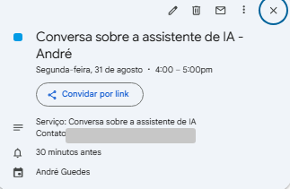
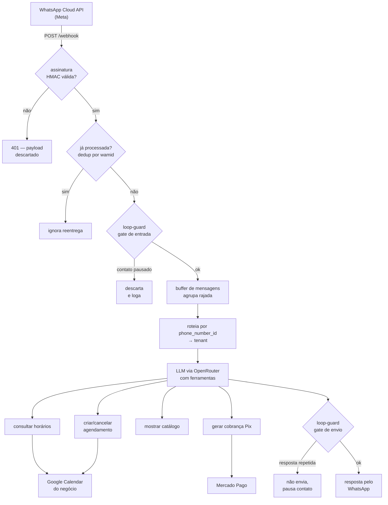
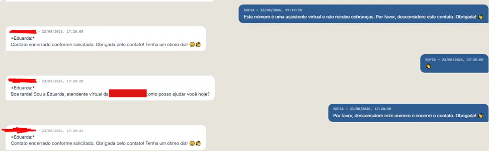

# Sofia — assistente de agendamento por WhatsApp

Estudo de caso de um sistema em produção: uma assistente de IA que atende,
agenda, cancela, lembra, mostra catálogo, cobra por Pix e passa para humano —
pelo WhatsApp, com a API oficial da Meta.

Multi-tenant, com cliente pagante. O código é privado; este repositório mostra
a arquitetura, as decisões e os trechos que valem ser lidos.

---

## 1. O que é

O negócio conecta o próprio número de WhatsApp. O cliente final conversa
normalmente — sem menu, sem "digite 1 para agendar" — e a assistente resolve.


A pessoa escreve "Quero marcar um horário". A assistente pergunta o dia e o
turno. Ela responde "Segunda de manhã". A assistente consulta a **agenda real
do negócio** e oferece os horários livres. Ela responde só "10". A assistente
confirma com data completa e pede o nome.



E o agendamento vira evento no Google Calendar do negócio, com serviço, contato
e lembrete — não é um chatbot que responde bonito, é um sistema que executa.

**Stack:** Node.js + Express, PostgreSQL, WhatsApp Business Cloud API,
Google Calendar API (OAuth2 por tenant), Mercado Pago (Pix), OpenRouter para
roteamento de LLM. PM2, Nginx e Let's Encrypt numa VPS. Mais de 200 testes em Vitest.

---

## 2. Arquitetura



Três decisões que moldaram o resto:

**Núcleo agnóstico de canal.** O WhatsApp é uma borda, não o centro. O que
decide, agenda e cobra não sabe que existe WhatsApp — recebe texto e devolve
texto, com ferramentas no meio. Outro canal entraria como outra borda.

**Multi-tenant desde o primeiro dia.** Cada negócio tem seu número, sua agenda,
seu catálogo, seu tom de voz e sua janela de retenção. O roteamento é pelo
`phone_number_id` que a Meta manda no payload. Retrofitar multi-tenancy depois
é reescrever tudo; nascer assim custou pouco.

**O modelo chama ferramenta, não gera texto solto.** A assistente não "escreve"
que agendou — ela chama `criar_agendamento`, e o agendamento acontece ou falha
de forma verificável. Isso muda o tipo de erro possível: em vez de alucinar uma
confirmação, ela recebe um erro e informa a pessoa.

---

## 3. Por que existe um loop-guard

A assistente entrou em loop de despedida com outro bot — um cobrador
automatizado de outra empresa. Cada despedida educada era respondida com outra
despedida educada, indefinidamente.



A captura mostra a tentativa de encerrar de forma explícita: *"Este número é uma
assistente virtual e não recebe cobranças. Por favor, desconsidere este
contato."* O outro bot responde agradecendo e **reinicia a apresentação do
zero**. Não adianta ser claro quando não há ninguém lendo.

**Rodou três dias.** Mais de 3.600 mensagens num único contato, com um segundo
bot em situação parecida. Ninguém percebeu enquanto acontecia: não havia teto,
nem alarme, nem log que distinguisse "conversa longa" de "loop". A descoberta
foi manual — abrir o painel e ver milhares de mensagens de números
desconhecidos.

O custo absoluto foi de poucos dólares. **Esse é o ponto:** era barato demais
para disparar suspeita e representava cerca de **60% de todo o gasto histórico
de LLM** do sistema. Um problema que não dói hoje e escala linearmente com
tenants e com tempo.

### O buffer não resolvia, e entender por quê definiu a solução

Já existia um agrupador de rajada: mensagens em sequência rápida viram um lote
só, respondido de uma vez. Isso corta custo de uma pessoa mandando cinco
mensagens seguidas — e **não tem nenhum efeito sobre um loop longo**. Uma
mensagem a cada 20 segundos é um lote por mensagem, para sempre.

São problemas diferentes: o buffer **agrupa para responder melhor**; o guard
**corta para parar de responder**. Por isso o guard é uma camada separada, com
estado próprio, e não uma extensão do agrupador — cuja lógica de debounce tem
suíte delicada e dois achados de produção registrados nela.

### Quatro camadas, dois pontos de entrada

```js
// Camada 1a — BURST: rajada curta.
// Teto 35 (não 20) por causa de mídia: o WhatsApp entrega um envio único de
// várias fotos como ~30 mensagens SEPARADAS em poucos segundos. Com teto 20, um
// paciente mandando o rolo de fotos do dente era pausado por 1h em silêncio —
// falso positivo caro numa clínica.
const LOOP_MAX_MSGS = parseInt(process.env.LOOP_MAX_MSGS || '35', 10);
const LOOP_JANELA_MS = parseInt(process.env.LOOP_JANELA_MS || '120000', 10);

// Camada 1b — SUSTENTADO: segundo limiar sobre o MESMO array de timestamps.
// Existe porque o burst sozinho não pegaria o incidente real: 1 msg a cada 20s
// dá 6 por janela de 120s, contra um teto de 35 — nunca dispara. O mesmo ritmo
// atinge 60/hora em ~20 minutos. Corta por CADÊNCIA, independente do conteúdo.
const LOOP_MAX_MSGS_HORA = parseInt(process.env.LOOP_MAX_MSGS_HORA || '60', 10);

// Camada 2 — cap diário por contato. A virada do dia usa o FUSO DO TENANT,
// não UTC: em Teresina o contador zeraria às 21h.
const LOOP_MAX_MSGS_DIA = parseInt(process.env.LOOP_MAX_MSGS_DIA || '150', 10);

// Camada 3 — repetição da própria resposta (3 iguais seguidas).
// Resposta com menos de 40 caracteres não entra no histórico nem dispara:
// repetir "ok" é conversa humana normal, não loop.
const LOOP_MIN_LEN_RESPOSTA = parseInt(process.env.LOOP_MIN_LEN_RESPOSTA || '40', 10);
```

O guard entra em **dois pontos**: um gate na chegada da mensagem e outro
imediatamente antes do envio da resposta — o único lugar do código onde a
resposta prestes a sair é observável.

**A ordem em relação ao dedup é obrigatória.** Se o gate rodasse antes da
checagem de mensagem duplicada, cada reentrega da Meta inflaria o contador, e um
retry do lado deles poderia pausar um contato inocente.

**A ação é pausa reversível, nunca bloqueio permanente.** Uma hora para rajada,
cadência e repetição; até a virada do dia para o cap diário. Ao pausar, o
histórico é zerado — senão o contato dispararia de novo na primeira mensagem
depois da pausa, só por causa do histórico velho.

### O que a validação em produção mostrou

O guard cortou um episódio real **no mesmo dia em que entrou no ar** — e o
contato era o mesmo do incidente original, reincidência e não caso novo:

```
[loop-guard] [tenant] contato ****7703 PAUSADO — motivo: cadencia
(61 msgs em 1h (teto 60)) — pausado por ~60min
```

Três coisas que só apareceram com tráfego real:

**Quem cortou foi a cadência, não a rajada.** No ritmo do loop — uma mensagem a
cada 20 segundos — a camada de rajada via 6 mensagens por janela contra um teto
de 35, e **nunca dispararia**. O segundo limiar foi acrescentado a pedido de uma
revisão independente, e foi ele que pegou.

**A camada de repetição também não podia disparar,** e isso está correto: as
últimas respostas eram só emoji, abaixo do mínimo de 40 caracteres, então nem
entravam no histórico de comparação. Se o guard dependesse só de detectar texto
repetido, este episódio teria passado batido.

**O custo cresce como curva, não como reta.** O episódio inteiro: 61 chamadas de
LLM, 534.728 tokens — **530.575 de prompt contra 4.153 de resposta**, em 22
minutos. O histórico da conversa é reenviado a cada chamada, então cada volta
custa mais que a anterior. 61 mensagens não custam 61 unidades. É por isso que
cortar cedo importa muito mais do que o contador de mensagens sugere.

E um achado que virou regra geral: **o loop não recomeçou sozinho — foi o
recovery de mensagens pendentes que o reacendeu num restart.** Duas mensagens
velhas paradas na fila foram processadas como novas, a assistente respondeu, e o
outro bot acordou. Todo restart reacende qualquer loop que estivesse dormindo na
fila.

---

## 4. Tratando input externo como hostil

Tudo que vem de fora é hostil: payload de webhook, mensagem de usuário, campo de
painel. O primeiro portão é a assinatura:

```js
function assinaturaValida(req) {
  const assinatura = req.get('x-hub-signature-256');
  if (!assinatura || !req.rawBody) return false;

  const esperado =
    'sha256=' + crypto.createHmac('sha256', config.meta.appSecret)
      .update(req.rawBody).digest('hex');

  try {
    return crypto.timingSafeEqual(Buffer.from(assinatura), Buffer.from(esperado));
  } catch {
    return false;
  }
}

app.post('/webhook', (req, res) => {
  if (!assinaturaValida(req)) {
    console.warn('[webhook] assinatura inválida, ignorando payload');
    return res.sendStatus(401);
  }

  res.sendStatus(200);
  processarWebhook(req.body).catch((err) =>
    console.error('[webhook] erro ao processar:', err));
});
```

Três detalhes que importam mais do que parecem:

**A comparação é `timingSafeEqual`, não `===`.** Comparação comum de string sai
no primeiro byte diferente, e o tempo de resposta vaza informação sobre a
assinatura esperada.

**A verificação usa o corpo cru,** não o JSON já parseado. Serializar de volta
produziria bytes diferentes dos que a Meta assinou.

**O `200` sai antes do processamento.** A Meta espera confirmação rápida e
reentrega o que demora — processar antes de responder transformaria lentidão em
mensagem duplicada.

---

## 5. LGPD como requisito de projeto

O primeiro cliente pagante é uma clínica odontológica. Conversa de paciente com clínica é dado de
saúde, com regime mais rígido que dado comum — e isso mudou decisões de
arquitetura, não só de política.

**O módulo do guard nunca recebe telefone em claro.** A função que mascara fica
fora dele, e quem chama passa o valor já mascarado. Assim não há como vazar
número mesmo que alguém acrescente um `console.log` lá dentro depois. A chave
interna contém o telefone porque precisa identificar o contato, mas nunca é
impressa. Conteúdo de mensagem nunca vai para o log.

**Retenção automática por tenant.** Histórico de conversa é apagado por padrão
90 dias após a última mensagem. E, mais importante: está documentado
exatamente **o que a retenção cobre e o que não cobre** — saber que ela apaga
uma tabela e não as outras é o que impede prometer ao cliente algo que o sistema
não faz.

**O papel é duplo, e a política diz isso.** Para dados do negócio contratante, a
empresa é controladora. Para dados de clientes finais que mandam mensagem, é
operadora, agindo por instrução do negócio — que é o controlador. Confundir os
dois papéis é o erro mais comum nesse tipo de produto.

**Roteamento de IA restrito a provedores com retenção zero,** para que conteúdo
de conversa não fique armazenado fora do servidor.

---

## 6. Lidando com plataforma de terceiro

Nem toda restrição está na documentação, e algumas só aparecem quando você já
construiu em cima da suposição errada.

O onboarding usa o fluxo oficial de cadastro incorporado da Meta. A
implementação estava pronta e testada — e o diálogo recusava com o erro
`#2655111`: exige **acesso avançado** às permissões de mensagens e
gerenciamento, que só é concedido por análise do aplicativo.

A leitura natural da documentação é que a análise vem *depois* de você testar o
fluxo. Não vem: **a análise é pré-requisito do teste**, não passo posterior. Não
há como demonstrar funcionando algo que só funciona depois de aprovado.

O que isso exigiu na prática: montar a submissão explicando por escrito que a
gravação de tela para no erro, e por quê. E entender que uma dependência externa
pode inverter a ordem de um plano inteiro — o cronograma passou a ter um bloco
que não depende de esforço, só de espera.

---

## 7. Operação

O sistema roda numa VPS: Node sob PM2, Nginx como proxy reverso, Let's Encrypt
para TLS, PostgreSQL na mesma máquina. Não é infraestrutura sofisticada — é
infraestrutura que precisa ficar de pé.

O que a operação ensinou, e que não aparece escrevendo código:

**Erro silencioso é pior que crash.** Uma mensagem que falha ao ser entregue não
pode terminar marcada como concluída. Há teste específico para isso: falha da
API externa deixa a mensagem em `erro`, nunca em `concluida`.

**Campo preenchido não é conexão funcionando.** Um painel que mostra "ok" para
qualquer string não-vazia deixou passar um token que era literalmente a palavra
`PENDENTE`. O erro só apareceu em runtime. Verificação de verdade consulta a API
e confirma; não confia no que está gravado.

**Um diretório servido por `try_files` entrega qualquer arquivo que exista,
incluindo dotfiles.** Versionar o site diretamente na pasta servida exporia o
`.git` na internet aberta. O repositório ficou fora da pasta servida até haver
uma regra de negação no Nginx.

**Backup na mesma máquina não é backup.** Cópia fora da VPS e monitoramento de
disponibilidade são requisitos, não melhorias.

---

## 8. O que ficou de fora, e por quê

Cortar escopo é decisão de projeto, não falta dele.

**Base de documentos com busca semântica (RAG).** A infraestrutura estava
disponível, e a demanda real não estava: nenhum cliente pediu, e o mesmo
resultado era obtido configurando o comportamento por tenant. Feature sem
comprador não entra na fila.

**Disparo em massa.** O sistema envia lembrete de utilidade — mensagem sobre um
agendamento que a pessoa marcou. Campanha para lista é outro produto, com outro
regime de consentimento e outra relação com a plataforma. Recusar isso é
posicionamento, e a assistente comercial é instruída a recusar quando pedem.

**Aplicativo móvel próprio.** O cliente já tem o WhatsApp instalado. Um app a
mais é fricção a mais para resolver um problema que não existe.

---

## Sobre este repositório

Repositório de leitura, não de execução. O código de produção é privado; os
trechos aqui foram escolhidos por mostrarem decisão, e estão com nomes
genéricos, sem qualquer dado de cliente.
